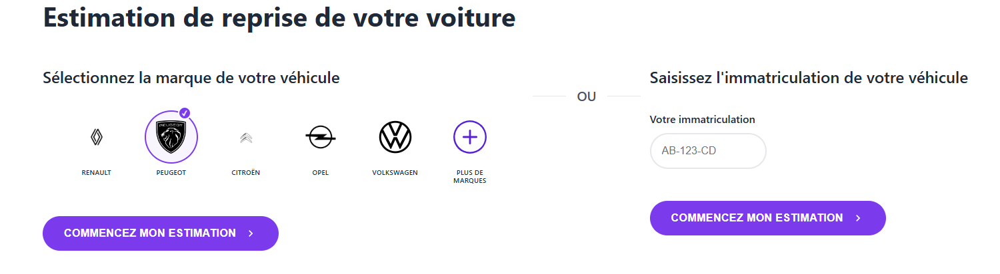
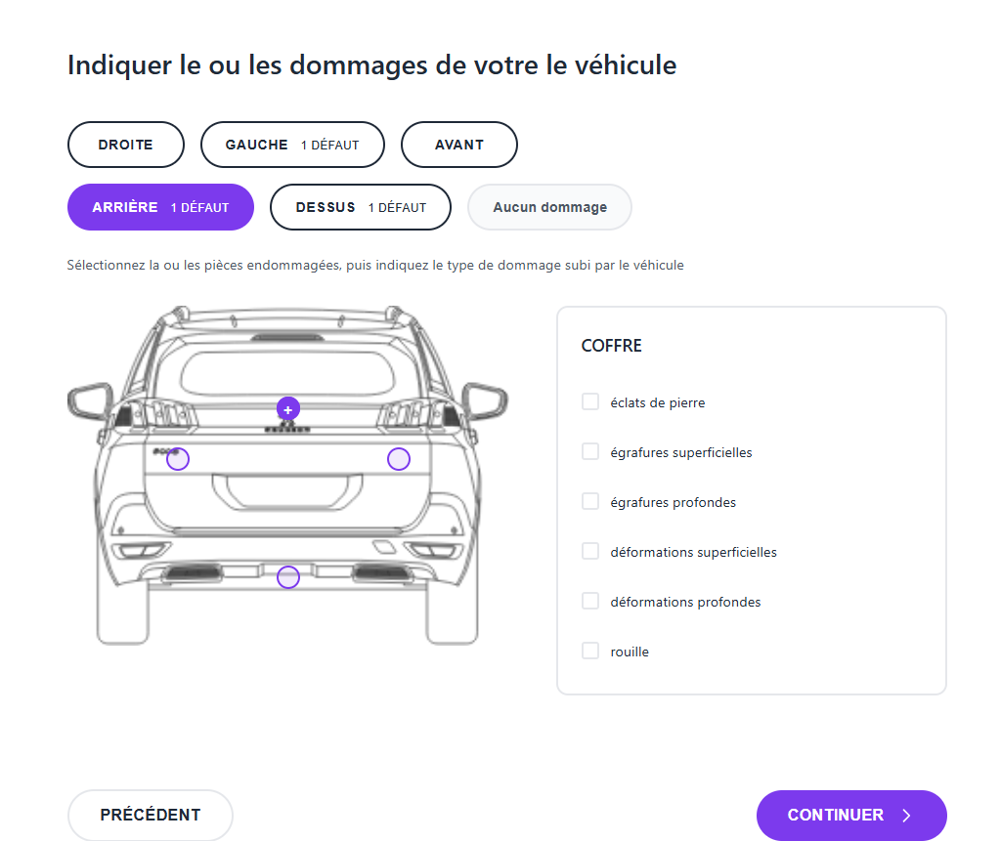

# Carserve

This web application allows users to estimate the trade-in value of their vehicle through a series of interactive steps. The app is built with HTML, CSS/SCSS, and JavaScript.

---
## Screenshots

  
   
   
  
   
   
   
   
  

---

## Features

1. **Vehicle Selection**
   - Select brand, model, version, color, fuel type, transmission, power, number of doors, and mileage.
   - Options for imported vehicles, first-hand ownership, vehicle condition, tires, maintenance, etc.

2. **Year and Month of Registration**
   - Simple interface with buttons to select year and month.
   - Navigation between pages while preserving data via URL parameters.

3. **Equipment Selection**
   - Choose available equipment (ABS, air conditioning, navigation system, sunroof, leather seats, alloy wheels, etc.).
   - Auto-selection if information is already available in the URL.

4. **Damage Reporting**
   - Select vehicle view (front, rear, right, left, top).
   - Select damaged parts and add markers on images.
   - Choose damage type for each part (scratches, dents, rust, stone chips, etc.).
   - Option "No Damage" to continue if the vehicle is in perfect condition.

5. **Vehicle Maintenance**
   - Questions about maintenance booklet and invoices.
   - Auto-selection if the user has already answered.

6. **User Profile**
   - Collect contact information such as name, phone number, and email.
   - Used for sending final estimation and follow-up.

7. **Final Estimation**
   - Display the estimated vehicle value.
   - Full summary of all entered information: brand, model, version, mileage, selected dealer, etc.

8. **Progress Bar**
   - Shows the user's progress throughout the estimation process.

9. **Navigation**
   - "PREVIOUS" and "CONTINUE" buttons for step-by-step navigation while preserving data.

---
## Technologies
- HTML5
- CSS3 / SCSS
- JavaScript (vanilla)

## Installation and Usage 
1. Clone the project: git clone https://github.com/rjerbi/Carserve.git
2. Open the project in your web browser: open index.html

